<div align="center">

<picture>
  <source media="(prefers-color-scheme: dark)"  srcset="./assets/hero-dark.svg">
  <source media="(prefers-color-scheme: light)" srcset="./assets/hero-light.svg">
  
</picture>

<br>

<a href="https://www.linkedin.com/in/adityakkoundinya/">
  
</a>
<a href="https://github.com/Koundinya2003/Portfolio">
  
</a>
<a href="https://github.com/Koundinya2003?tab=repositories">
  
</a>


</div>

## 🧭 About

I'm a **Product Manager** working where data, AI and business strategy meet. I like the unglamorous
middle of the job: finding the real problem inside messy user feedback, arguing it down to one
sentence, and then shipping the smallest thing that proves it.

```yaml
name:     Aditya K Koundinya
role:     Product Manager — data & AI-driven products
focus:    Product strategy · Discovery · Metrics · Applied GenAI
contact:  linkedin.com/in/adityakkoundinya

how_i_work:
  discover:  "Talk to users, mine reviews, size the problem before naming a solution"
  define:    "PRDs, KPI trees and prioritization frameworks — decisions on paper, not vibes"
  prototype: "Build the thing with LLMs to test the bet before it costs a sprint"
  measure:   "Instrument early, argue with the data, kill what does not move the metric"

building:  AI assistants · review-intelligence pipelines · discovery engines
exploring: Real-world business use cases for LLMs
open_to:   Product Manager roles · AI product collaborations
```

<div align="center"></div>

## ⏳ Where I Spend My Time

<div align="center">
<picture>
  <source media="(prefers-color-scheme: dark)"  srcset="./assets/focus-dark.svg">
  <source media="(prefers-color-scheme: light)" srcset="./assets/focus-light.svg">
  
</picture>
</div>

<div align="center"></div>

## 🚀 Featured Work

<div align="center">


</div>

### 🧪 MVPs

<sub>Working prototypes built to test a hypothesis — instrumented, scoped, and honest about what they haven't proven yet.</sub>

<table>
<tr>
<td width="50%" valign="top">

#### 👗 [Nykaa Fit](https://github.com/Koundinya2003/nykaa-fit-mvp)

A Nykaa Fashion–style storefront with personalised size guidance on the product page. The engine is deterministic and offline — your measurements against the brand's published chart — and it **declines to answer rather than guess**. Ships with an A/B experiment and a Fit Lab that reports "not enough data" instead of inventing a result.

[](https://nykaa-fit-mvp.vercel.app/)


</td>
<td width="50%" valign="top">

#### 🛒 [Blinkit AI Assistant](https://github.com/Koundinya2003/Blinkit-Ai_assistantV1)

An experiment in bolting a conversational assistant onto a quick-commerce shopping flow — testing whether chat beats search when you're assembling a grocery basket.


</td>
</tr>
</table>

### 🤖 AI Projects

<sub>Applied GenAI where the constraint is trust — assistants that cite, decline, and stay inside what they can actually verify.</sub>

<table>
<tr>
<td width="50%" valign="top">

#### 🎯 [Recruiter Info](https://github.com/Koundinya2003/recruiter_info)

Describe the roles you want in plain English. It queries public job APIs and companies' own boards, **validates every posting before showing it**, finds publicly published contacts, and tracks each application. It never invents a job, a person, or an email — "could not confirm" is a first-class outcome.

[](https://recruiter-info-1.onrender.com/)


</td>
<td width="50%" valign="top">

#### 📊 [Wealth Monitor](https://github.com/Koundinya2003/wealth-monitor-review-intelligence)

An AI personal-finance coach for Indian users — personalised investment planning, wealth projections and AI-driven market discovery, backed by a review-intelligence pipeline.


</td>
</tr>
<tr>
<td width="50%" valign="top">

#### 🔍 [AI Discovery Engine](https://github.com/Koundinya2003/AI-Discovery-Engine)

Search app reviews at scale, surface the themes hiding inside them, then interrogate the whole corpus through an AI assistant.


</td>
<td width="50%" valign="top">

#### 🤖 [MF FAQ Chatbot](https://github.com/Koundinya2003/MF_FAQ_CB)

A facts-only assistant for mutual fund schemes — expense ratios, exit loads, SIP minimums, ELSS lock-ins. No opinions, no invented advice.


</td>
</tr>
</table>

### 📝 PRDs & Case Studies

<sub>The written half of the job — teardowns, business cases and prioritization work, argued to a decision rather than a summary.</sub>

<table>
<tr>
<td width="50%" valign="top">

#### 💼 [Engati × Canara Bank](https://github.com/Koundinya2003/engati-pitch-prd)

An executive business case: pitch Engati to Canara Bank's CEO on Day 0, then return at Day 180 with measured evidence to justify renewal and a price increase. Baseline, operating model, pilot roadmap with exit criteria — and a scorecard agreed **before** deployment, not after.


</td>
<td width="50%" valign="top">

#### 📈 [Prioritization, Metrics &amp; Growth](https://github.com/Koundinya2003/Prioritization-Metrics-Growth)

Why urban Indian mobile users avoid voice input — and the growth strategy to fix it. Full KPI tree, prioritization framework and a defensible bet.


</td>
</tr>
<tr>
<td width="50%" valign="top">

#### 🔧 [n8n Product Teardown](https://github.com/Koundinya2003/n8n-product-teardown)

A structured teardown of n8n — onboarding gaps, activation metrics and a prioritized fix list, written the way I'd hand it to an engineering team.


</td>
<td width="50%" valign="top">

#### 📝 [Eureka PRD](https://github.com/Koundinya2003/Eureka_PRD)

Teardown of the Eureka learning app: where onboarding leaks users, what the data implies, and the single biggest growth opportunity worth funding.


</td>
</tr>
</table>

<div align="center">

**[→ Browse every repository](https://github.com/Koundinya2003?tab=repositories)**


</div>

## 🧰 Toolkit

<div align="center">

<picture>
  <source media="(prefers-color-scheme: dark)"  srcset="https://skillicons.dev/icons?i=py,js,ts,html,css,git,github,vscode,figma,notion&theme=dark">
  <source media="(prefers-color-scheme: light)" srcset="https://skillicons.dev/icons?i=py,js,ts,html,css,git,github,vscode,figma,notion&theme=light">
  
</picture>

</div>

<table>
<tr>
<td width="33%" valign="top" align="center">

**Product**


</td>
<td width="33%" valign="top" align="center">

**Data**


</td>
<td width="33%" valign="top" align="center">

**Build**


</td>
</tr>
</table>

<div align="center"></div>

## 🤝 Let's Build Something

<div align="center">

Hiring for a **product role**, or want a second pair of eyes on an **AI product idea**?
I'm always up for a conversation about either.

<a href="https://www.linkedin.com/in/adityakkoundinya/">
  
</a>


<sub>Thanks for stopping by — let's build something useful together. 🚀</sub>

</div>
