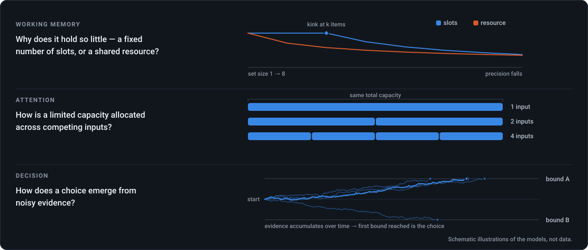

<picture>
  <source media="(prefers-color-scheme: dark)"  srcset="./assets/hero-dark.svg">
  <source media="(prefers-color-scheme: light)" srcset="./assets/hero-light.svg">
  
</picture>

[LinkedIn](https://www.linkedin.com/in/adityakkoundinya/) · [Email](mailto:aditya003koundinya@gmail.com)

## Research interests

I study the mind as an information processing system. The questions that pull me in are about its logical architecture:

* Why does working memory hold so little, and is its limit a fixed number of slots or a shared resource?
* How does attention allocate a limited capacity across competing inputs?
* How do decisions emerge from noisy evidence, and how can signal detection theory separate sensitivity from bias?

<picture>
  <source media="(prefers-color-scheme: dark)"  srcset="./assets/questions-dark.svg">
  <source media="(prefers-color-scheme: light)" srcset="./assets/questions-light.svg">
  
</picture>

My background in Computer Science and Engineering gives me formal logic, probability, algorithms and code for simulation and statistical modelling. I want to use these to build and test formal models of cognition.

## Featured research

### [Music, Emotion and the Brain: EEG Analysis of Subjective Experience](https://github.com/Koundinya2003/met-eeg-project-push)

**Question.** Within individuals, is self reported emotional experience (valence and arousal) during music listening associated with EEG band power, beyond what is shared across listeners for the same song?

**Design.** Preregistered before any results were seen. 20 participants and 395 clean trials from the MET dataset (OpenNeuro ds008701). Ratings split into song consensus and personal deviation. Mixed effects models with random intercepts for person and song.

**Hypotheses.**

1. Higher arousal predicts lower posterior alpha power.
2. Higher valence predicts greater frontal alpha asymmetry.
3. These slopes vary between people.

**Result.** All three confirmatory tests were null, and no exploratory test survived FDR correction. The pattern held across six alternative analysis choices. Limitations are documented in full.

<picture>
  <source media="(prefers-color-scheme: dark)"  srcset="./assets/met-figure-dark.svg">
  <source media="(prefers-color-scheme: light)" srcset="./assets/met-figure-light.svg">
  
</picture>

**Methods.** R, lme4, Welch spectra, Bonferroni and Benjamini Hochberg correction, sensitivity analysis, full reproducibility from a single script.

## Next

* Slot versus resource models of working memory capacity, fitted to open change detection data
* A signal detection toolkit: d prime, criterion and ROC curves, with simulations

## Methods toolkit

**Modelling and statistics:** mixed effects models, hypothesis testing, multiple comparison correction, simulation, signal detection theory

**Languages:** R, Python, SQL

**Open science:** preregistration, reproducible pipelines, open datasets

## Earlier work: product and data

Before moving into cognitive science I worked in data analytics at Bosch and completed the NextLeap product fellowship. That work trained me in hypothesis driven user research and measurement.

* [Prioritization, Metrics and Growth](https://github.com/Koundinya2003/Prioritization-Metrics-Growth): why urban Indian mobile users avoid voice input, from interviews and UX analysis
* [AI Discovery Engine](https://github.com/Koundinya2003/AI-Discovery-Engine): theme discovery across large sets of app reviews
* [Recruiter Info](https://github.com/Koundinya2003/Recruiter_info): a job search tool that validates every posting before showing it
* [Nykaa Fit](https://github.com/Koundinya2003/nykaa-fit-mvp): a size recommendation experiment with an A/B test
* [All repositories](https://github.com/Koundinya2003?tab=repositories)
